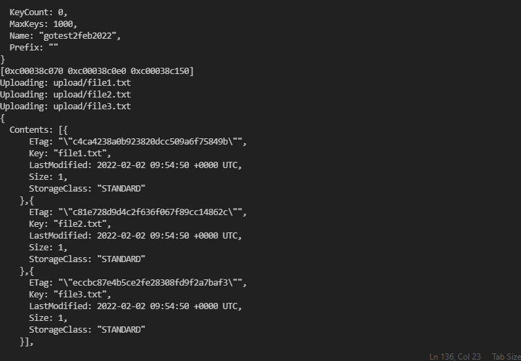

### GoLang AWS Practise

Pre-Requisite:  
- Visual Studio Code   
- Install Go from https://go.dev/ 
- Postman app from https://www.postman.com/downloads/  

Check Go Configuaration using VS Terminal by running below commands  
- go --version  
- go env  

### Code Practises  
1) S3 Bucket Sample  

### Output Screenshots:
1) S3 Bucket Sample
 